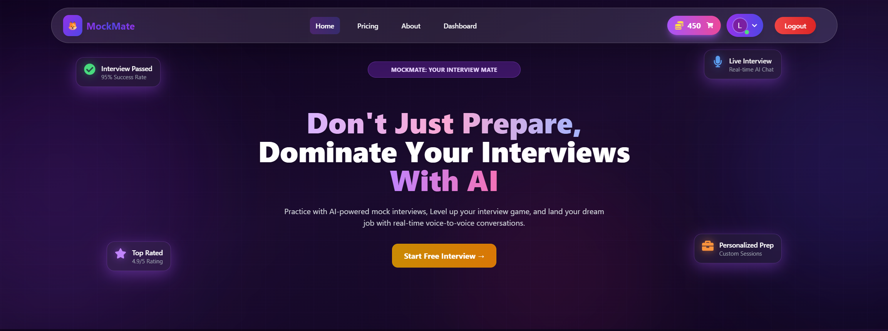
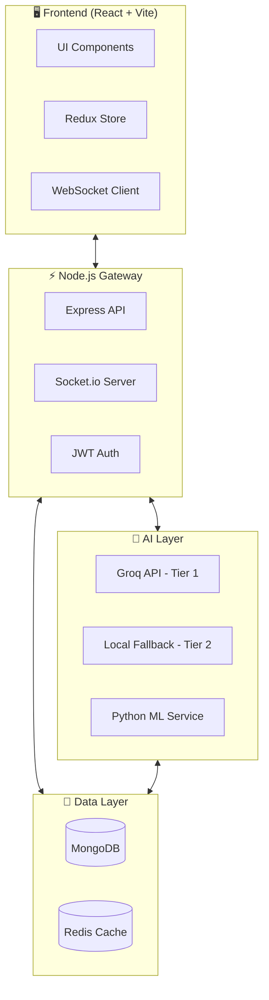
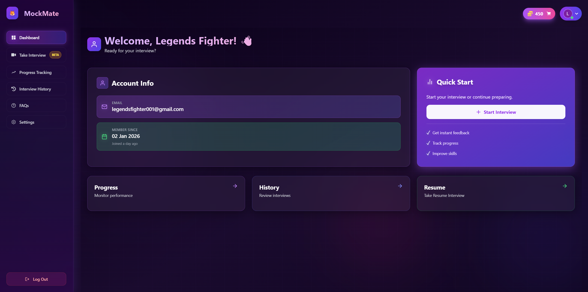
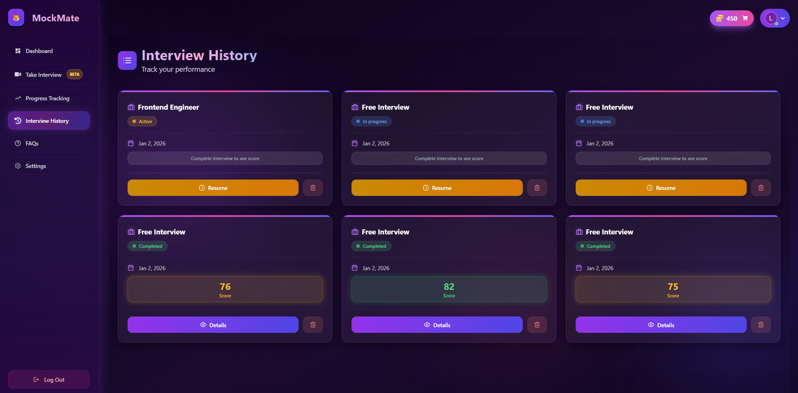
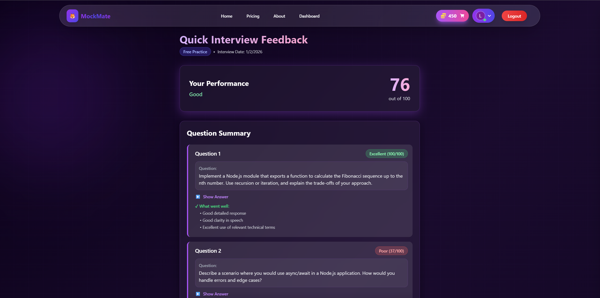
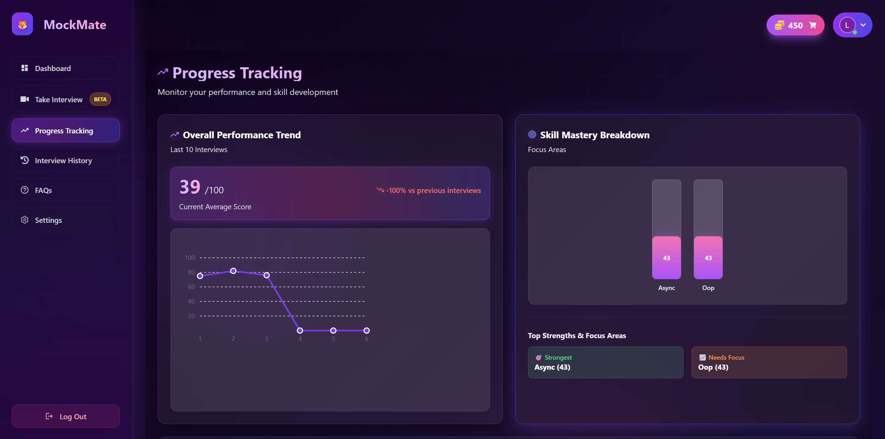

<div align="center">

# 🎯 MockMate

### *Your AI-Powered Interview Preparation Partner*

[](https://reactjs.org/)
[](https://nodejs.org/)
[](https://mongodb.com/)
[](https://tailwindcss.com/)

[](LICENSE)
[](CONTRIBUTING.md)
[](https://github.com/Dwarika202249/MockMate)

<br />

<p align="center">
  
</p>

**Practice interviews with AI. Get instant feedback. Land your dream job.**

[🚀 Live Demo](https://mockmateio.netlify.app/) · [📖 Documentation](https://docs.mockmate.ai) · [🐛 Report Bug](https://github.com/Dwarika202249/mockmate/issues) · [✨ Request Feature](https://github.com/Dwarika202249/mockmate/issues)

</div>

---

## 🌟 What is MockMate?

**MockMate** is a cutting-edge AI interview preparation platform that combines advanced language models with real-time voice interactions to simulate authentic interview experiences. Whether you're a software engineer, product manager, or data scientist, MockMate helps you practice, improve, and gain confidence.

<div align="center">

| 🎤 Voice Interviews | 🧠 AI Feedback | 📊 Analytics | 🔒 Privacy First |
|:---:|:---:|:---:|:---:|
| Real conversation practice with speech-to-text | Instant detailed analysis of your answers | Track progress across sessions | Your data stays secure |

</div>

---

## ✨ Features

<table>
<tr>
<td width="50%">

### 🤖 AI-Powered Intelligence
- **Smart Question Generation** — Questions tailored to your resume and target role
- **2-Tier Failover System** — Groq API with local fallback for reliability
- **Natural Language Evaluation** — Deep analysis of your responses
- **Keyword Detection** — Identifies technical terms and concepts

</td>
<td width="50%">

### 🎙️ Voice Experience
- **Real-time STT** — Speech-to-text for natural responses
- **TTS Playback** — Questions read aloud like real interviews
- **Silence Detection** — Smart pause handling
- **Audio Recording** — Review your performance

</td>
</tr>
<tr>
<td width="50%">

### 📈 Progress Tracking
- **Performance Analytics** — Scores, trends, and insights
- **Interview History** — Review past sessions
- **Skill Progression** — See improvement over time
- **Personalized Tips** — AI-generated recommendations

</td>
<td width="50%">

### 🔐 Enterprise Security
- **JWT Authentication** — Secure token-based auth
- **Refresh Token Rotation** — Enhanced session security
- **Encrypted Storage** — Data protected at rest
- **GDPR Compliant** — Privacy by design

</td>
</tr>
</table>

---

## 🛠️ Tech Stack

<div align="center">

### Frontend


### Backend


### AI & ML


</div>

---

## 🏗️ Architecture



---

## 🚀 Quick Start

### Prerequisites

- **Node.js** 18+ 
- **MongoDB** 6.0+
- **Redis** 7.0+ (optional, for queues)
- **Groq API Key** (free tier available)

### Installation

```bash
# Clone the repository
git clone https://github.com/yourusername/mockmate.git
cd mockmate

# Install backend dependencies
cd backend
npm install

# Install frontend dependencies
cd ../frontend
npm install
```

### Environment Setup

```bash
# Backend (.env)
cp backend/.env.example backend/.env
```

```env
# backend/.env
MONGO_URI=mongodb://localhost:27017/mockmate
JWT_SECRET=your-super-secret-key
GROQ_API_KEY=your-groq-api-key
REDIS_URL=redis://localhost:6379
GOOGLE_CLIENT_ID=your-google-client-id
```

```bash
# Frontend (.env)
cp frontend/.env.example frontend/.env
```

```env
# frontend/.env
VITE_API_URL=http://localhost:5000
VITE_WS_URL=ws://localhost:5000
VITE_GOOGLE_CLIENT_ID=your-google-client-id
```

### Run Development Servers

```bash
# Terminal 1: Start backend
cd backend
npm run dev

# Terminal 2: Start frontend
cd frontend
npm run dev
```

<div align="center">

🎉 **Open [http://localhost:5173](http://localhost:5173) and start practicing!**

</div>

---

## 📖 API Reference

### Authentication

| Endpoint | Method | Description |
|----------|--------|-------------|
| `/api/auth/register` | POST | Create new account |
| `/api/auth/login` | POST | Login with credentials |
| `/api/auth/google` | POST | Google OAuth login |
| `/api/auth/refresh` | POST | Refresh access token |
| `/api/auth/logout` | POST | Invalidate session |

### Interviews

| Endpoint | Method | Description |
|----------|--------|-------------|
| `/api/interview/start` | POST | Start new interview |
| `/api/interview/:id` | GET | Get interview details |
| `/api/interview/:id/answer` | POST | Submit answer |
| `/api/interview/:id/end` | POST | End interview |

### WebSocket Events

```javascript
// Client → Server
socket.emit('INITIALIZE_INTERVIEW', { resumeId, preferences });
socket.emit('SUBMIT_ANSWER', { interviewId, questionId, answer });

// Server → Client
socket.on('QUESTIONS_READY', (questions) => { ... });
socket.on('ANSWER_EVALUATED', (feedback) => { ... });
socket.on('INTERVIEW_COMPLETED', (summary) => { ... });
```

---

## 📁 Project Structure

```
mockmate/
├── 📂 backend/
│   ├── 📂 config/         # Configuration files
│   ├── 📂 controllers/    # Route controllers
│   ├── 📂 middleware/     # Express middleware
│   ├── 📂 models/         # Mongoose schemas
│   ├── 📂 routes/         # API routes
│   ├── 📂 socket/         # WebSocket handlers
│   ├── 📂 utils/          # Utilities & AI provider
│   ├── 📂 workers/        # Background job processors
│   └── 📄 index.js        # Entry point
│
├── 📂 frontend/
│   ├── 📂 public/         # Static assets
│   └── 📂 src/
│       ├── 📂 components/ # React components
│       ├── 📂 contexts/   # React contexts
│       ├── 📂 hooks/      # Custom hooks
│       ├── 📂 layouts/    # Layout components
│       ├── 📂 pages/      # Page components
│       ├── 📂 redux/      # Redux store & slices
│       ├── 📂 routes/     # Route definitions
│       ├── 📂 services/   # API services
│       └── 📂 utils/      # Utility functions
│
└── 📂 docs/               # Documentation
```

---

## 🎨 Screenshots

<div align="center">

| Dashboard | Interview Session |
|:-:|:-:|
|  |  |

| Feedback Analysis | Progress Tracking |
|:-:|:-:|
|  |  |

</div>

---

## 🤝 Contributing

Contributions are what make the open source community amazing! Any contributions you make are **greatly appreciated**.

1. Fork the Project
2. Create your Feature Branch (`git checkout -b feature/AmazingFeature`)
3. Commit your Changes (`git commit -m 'Add some AmazingFeature'`)
4. Push to the Branch (`git push origin feature/AmazingFeature`)
5. Open a Pull Request

See [CONTRIBUTING.md](CONTRIBUTING.md) for detailed guidelines.

---

## 📋 Roadmap

- [x] Core interview flow with AI
- [x] Voice-based interviews (STT/TTS)
- [x] Real-time WebSocket communication
- [x] Resume parsing & analysis
- [x] Glassmorphism UI design
- [ ] Multi-language support
- [ ] Video interviews with emotion detection
- [ ] Mobile app (React Native)
- [ ] Team/Enterprise features
- [ ] Interview recording playback

---

## 📄 License

Distributed under the **MIT License**. See [LICENSE](LICENSE) for more information.

---

## 💖 Acknowledgments

- [Groq](https://groq.com/) — Lightning-fast AI inference
- [React](https://reactjs.org/) — UI library
- [Tailwind CSS](https://tailwindcss.com/) — Styling framework
- [Framer Motion](https://www.framer.com/motion/) — Animations
- [Socket.io](https://socket.io/) — Real-time communication

---

<div align="center">

### 🌟 Star this repo if MockMate helped you!

<br />

**Built with ❤️ by the MockMate Team**

[Website](https://mockmateio.netlify.app/) · [Twitter](https://twitter.com/mockmate_ai) · [Discord](https://discord.gg/mockmate)

<br />

<sub>© 2026 MockMate. All rights reserved.</sub>

</div>
